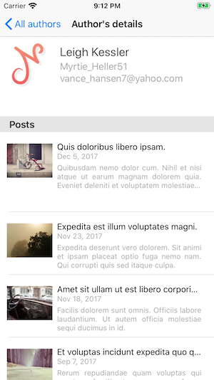
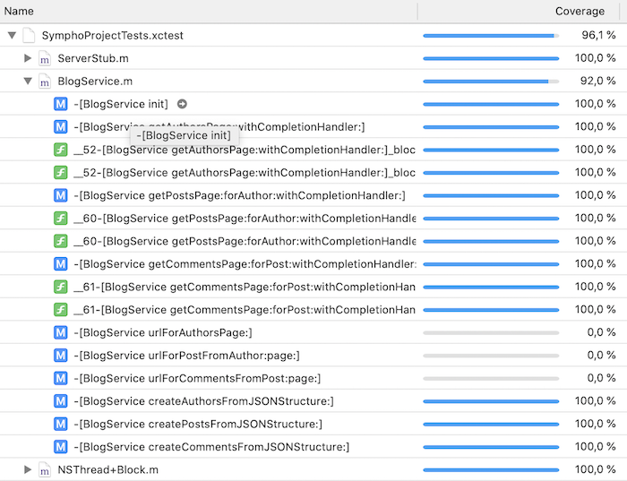

Here's my client app for the micro blogging platform.

Here are the main ideas I sticked with in order to have a robust and reliable core app in the given timeframe:

- Clear split between UI / Business and clean dependencies : the business objects are in the /services directory and the UI accesses the service through 1 well identified entry point: the `BlogService` class. The UI classes (ViewControllers and associated classes) are in /UI directory.
Dependencies are always in the direction UI -> Business.

- Threading: when writing UI code, the update of the UI should be performed in the context of the main UIKit thead. However, accessing server data can be slow and should be performed in a background thread. The Blog service implements this pattern by performing the requests in a background thread and gives the feedback in the same thread that performed the request (generally the main thread as requests are due to user interactions invoked in the main thread).

- Clean UI and Clean UI Code: I have a special interest in very nice looking UX / UI but here I stick to classic patterns that work: a `UIPaginatedTableViewController` handles the download of content per pages by automatically triggering the download of the next page when the end of the list is reached (if some more content is available).
This class is subclassed by the 3 ViewControllers handling the 3 screens for all authors, one author posts, and all comments for one post.
This enables a seemless browsing for the user browsing the blogs content.

- UTesting : I used cached server responses in order to perform some very basic UTests: the goal is just to ensure that the JSON parsing is ok and reflects the server content. It also checks that the threading model is correct.
Coverage for the business logic layer is 96%.

The application has been tested on a real iOS device only on an iPhone 6s running iOS 13.5.1
